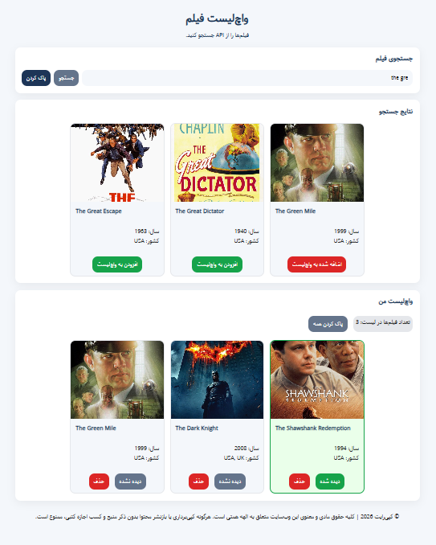
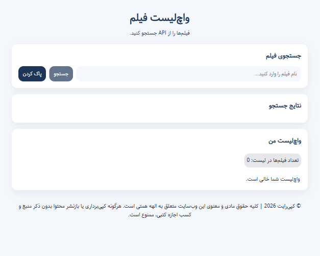
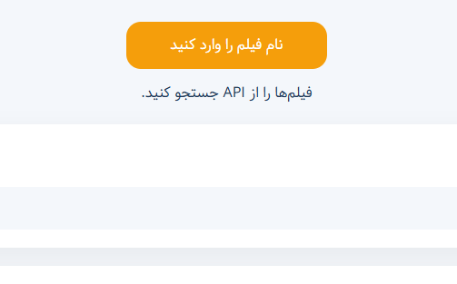

markdown
# Movie Search & Watchlist

> **[🔗 Live Demo / دموی زنده](https://elahe-hemmati.github.io/movie-search-watchlist/)**

---

## English

A movie search web app using a domestic Iranian API (works with Iran's national internet – no VPN needed). Built to demonstrate **JavaScript async programming**, **OOP**, and **clean code architecture**. *Note: The API has a limited movie database; the focus is on front-end skills, not comprehensive movie data.*

### Key Features

- **Movie search** – Search by English movie title
- **API integration** – Domestic Iranian API (no VPN needed)
- **Watchlist** – Add/remove movies to personal watchlist
- **LocalStorage** – Watchlist persists after page refresh
- **Watch status** – Mark movies as watched/unwatched
- **Bulk actions** – Clear entire watchlist with one click
- **Toast notifications** – Feedback for add, remove, errors, etc.
- **Loading animation** – Shows while fetching API data
- **Error handling** – Handles API errors, network issues, empty searches
- **Fully responsive** – Grid/Flex layout, works on mobile/tablet/desktop
- **Clean code** – OOP structure, separated concerns

### Technologies

- HTML5
- CSS3 (Flexbox, Grid, Responsive)
- JavaScript (ES6+)
  - Async/Await
  - Fetch API
  - Classes (OOP)
  - LocalStorage
- Domestic Iranian API

### How to Run

```bash
git clone https://github.com/elahe-hemmati/movie-search-watchlist.git
cd movie-search-watchlist
# Then open index.html in your browser
```

### Project Structure

```
├── index.html
├── fonts/
├── css/
│   └── style.css
├── js/
│   ├── app.js
│   ├── api.js
│   ├── watchlist.js
│   ├── ui.js
│   └── toast.js
└── img/
```

### Screenshots

| Search Results & Watchlist | Empty State | Toast Notification |
|----------------------------|-------------|--------------------|
|  |  |  |

### What I Learned / Skills Demonstrated

- Working with asynchronous JavaScript (fetch, async/await)
- Object-oriented programming (classes, separation of concerns)
- DOM manipulation and event handling
- State management with LocalStorage
- Error handling and user feedback (toasts)
- Clean, maintainable code structure

### Contact

Elahe Hemmati – [GitHub](https://github.com/elahe-hemmati) – elahe.ali.hemmati@gmail.com

---

## فارسی

 یک اپلیکیشن جستجوی فیلم با استفاده از API داخلی ایران (کار با اینترنت ملی – بدون نیاز به VPN). این پروژه برای نمایش مهارت‌های **JavaScript ناهمزمان**، **OOP** و **کد تمیز** طراحی شده است. *تذکر: دیتابیس این API محدود است و همه فیلم‌ها را ندارد – تمرکز پروژه روی مهارت‌های فرانت‌اند است.*

### ویژگی‌های اصلی

- **جستجوی فیلم** – جستجو با نام انگلیسی فیلم
- **داخلی (API)** – بدون نیاز به VPN، کار با اینترنت ملی ایران
- **واچ لیست** – اضافه و حذف فیلم به لیست شخصی
- **ذخیره محلی** – واچ لیست بعد از رفرش صفحه باقی می‌ماند
- **وضعیت تماشا** – علامت زدن فیلم‌های دیده شده/نشده
- **عملیات گروهی** – پاک کردن کل واچ لیست با یک کلیک
- **اعلان toast** – نمایش پیام برای اضافه، حذف، خطا و...
- **انیمیشن لودینگ** – هنگام دریافت اطلاعات از API
- **مدیریت خطا** – خطاهای API، مشکلات شبکه، جستجوی خالی
- **طراحی ریسپانسیو** – گرید و فلکس، سازگار با موبایل و تبلت
- **کد تمیز** – ساختار OOP، تفکیک وظایف

### تکنولوژی‌ها

- HTML5
- CSS3 (فلکس، گرید، ریسپانسیو)
- JavaScript (ES6+)
  - Async/Await
  - Fetch API
  - Classes (OOP)
  - LocalStorage
- API داخلی ایران

### نحوه اجرا

```bash
git clone https://github.com/elahe-hemmati/movie-search-watchlist.git
cd movie-search-watchlist
# سپس فایل index.html را در مرورگر باز کنید
```

### ساختار پروژه

```
├── index.html
├── fonts/
├── css/
│   └── style.css
├── js/
│   ├── app.js
│   ├── api.js
│   ├── watchlist.js
│   ├── ui.js
│   └── toast.js
└── img/
```

### اسکرین‌شات‌ها

| نتایج جستجو و واچ لیست | حالت خالی | اعلان toast |
|--------------------------|------------|-------------|
|  |  |  |

### مهارت‌های نشان داده شده

- کار با JavaScript ناهمزمان (fetch، async/await)
- برنامه‌نویسی شی‌گرا (کلاس‌ها، تفکیک وظایف)
- دستکاری DOM و مدیریت رویدادها
- مدیریت state با LocalStorage
- مدیریت خطا و بازخورد به کاربر
- ساختار کد تمیز و قابل نگهداری

### ارتباط با من

الهه همتی – [گیت‌هاب](https://github.com/elahe-hemmati) – elahe.ali.hemmati@gmail.com
